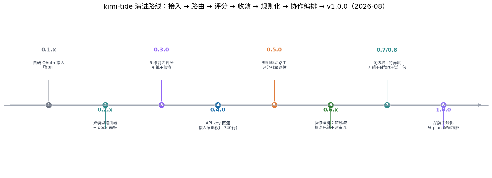
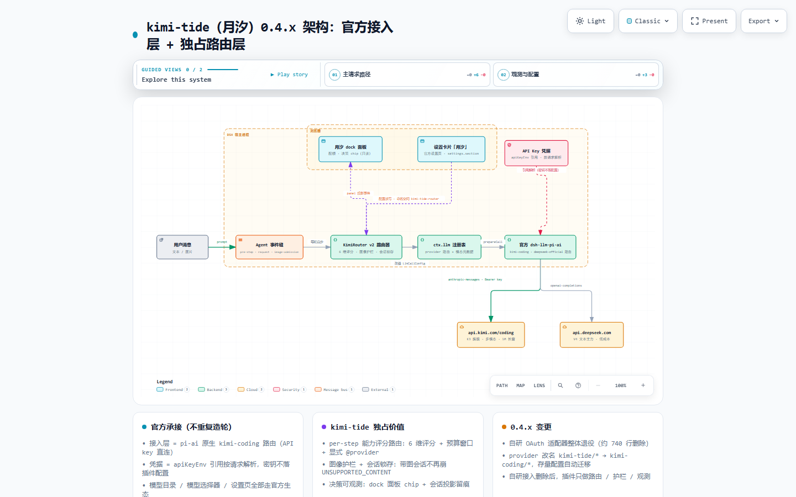
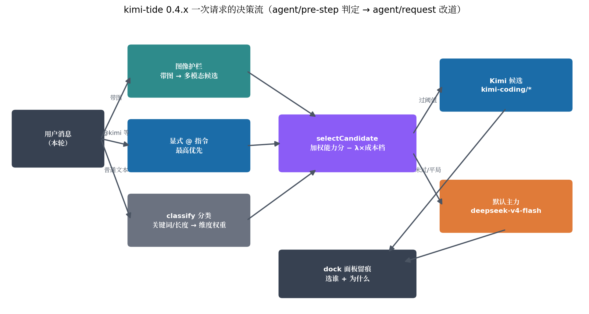
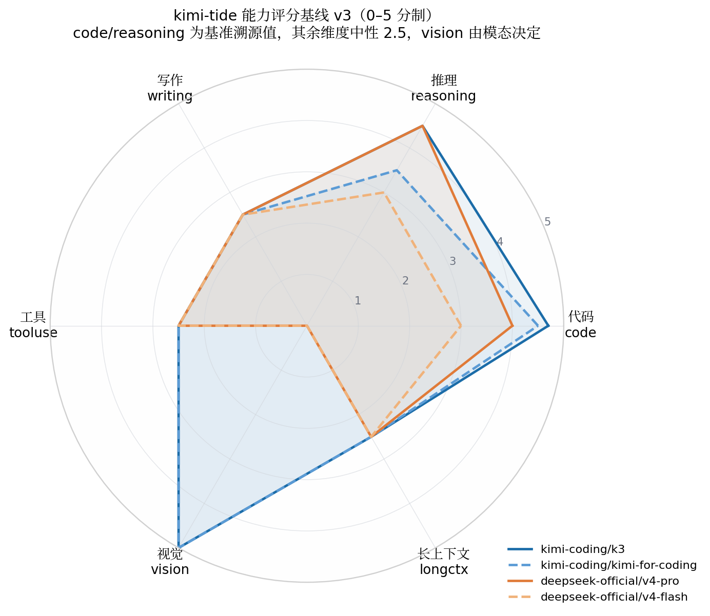
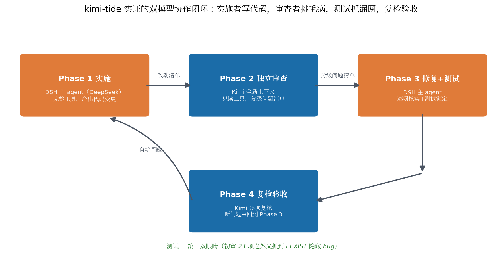
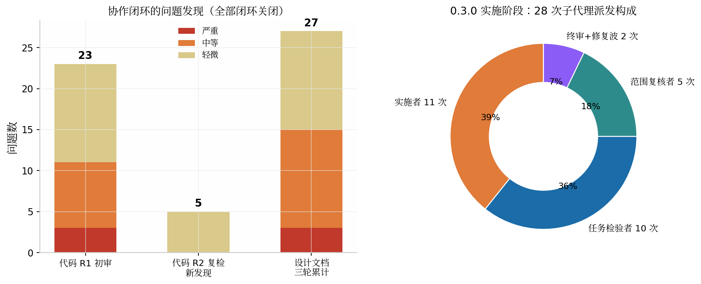
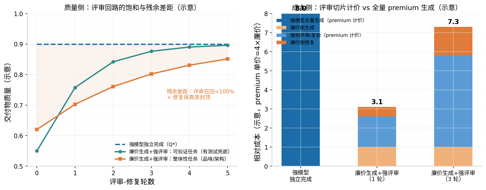
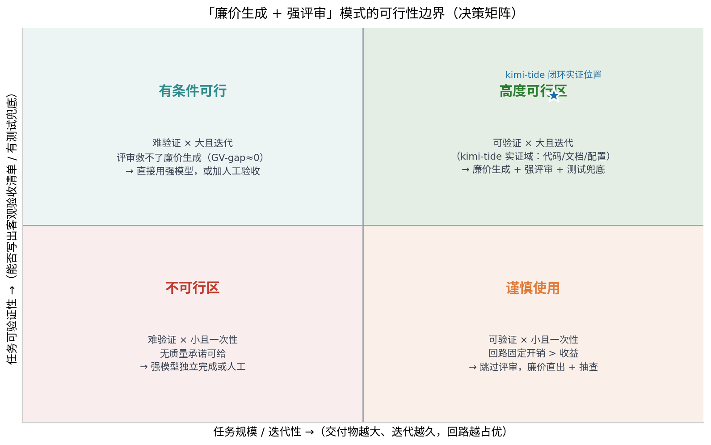

# kimi-tide（月汐）双模型协作研究：架构、损耗与可行性

> 研究对象：GitHub 开源项目 [tafcear/kimi-tide](https://github.com/tafcear/kimi-tide)（月汐）——DeepSeek Harness（DSH）生态中让 **Kimi** 与 **DeepSeek** 两个大模型自动分工的路由插件，以及该项目自身实践并文档化的「双模型协作开发闭环」方法论。研究覆盖三条主线：插件的路由与护栏**架构**、双模型「廉价生成 + 强评审」模式的**损耗**结构、以及该模式的**可行性**边界。
>
> **作者**：[tafcear](https://github.com/tafcear)（kimi-tide 项目作者）× Kimi（AI 研究协作）
> 研究基准日：2026-08-21（首版）／2026-08-31（v1.0.0 追踪更新）｜ 项目最新发布：**v1.0.0（2026-08-29）**｜ 0.5.0 规则驱动路由已发布，协作编排（0.6.0）已落地。

## 摘要

kimi-tide 是一个以「**按任务逐步骤在两个大模型之间自动选路**」为核心命题的工程实验：在 DeepSeek Harness（DSH）这一「一切皆插件」的 Agent 宿主里[^80^]，让便宜快速的 DeepSeek V4 跑日常文本任务、让多模态且长上下文的 Kimi K3 攻难关与看图任务，并把每一次选择的理由实时呈现在面板上[^1^]。项目在 2026 年 8 月完成了八段演进——自研 OAuth 接入（0.1.x）→ 双模型路由器（0.2.x）→ 六维能力评分引擎（0.3.0）→ 接入层收敛为官方 API Key 直连并整体删除约 740 行自研代码（0.4.x）→ 规则驱动路由落地、评分引擎退役（0.5.0）→ 协作编排：规则目标泛化为「模型｜协作流」，图像转述流根治锁存死锁、评审回路产品化为内建流（0.6.x）→ 关键词匹配准确性与规则体系补全（0.7.0/0.8.0）→ 品牌主题化 + 多 plan 配额的大版本 v1.0.0（2026-08-29，497/497 测试绿）[^1^]。本研究认为，该项目的价值不止于插件本身：其一，它提供了一个**双模型路由从「评分驱动」退守「规则驱动」的完整决策记录**，是观察 LLM 路由学术范式（FrugalGPT、RouteLLM、Hybrid LLM 等）在真实工程中如何被裁剪的罕见样本；其二，它用自身的开发过程实证了一条「**实施者写代码、独立模型审查、测试兜底、复检验收**」的双模型协作闭环——三轮应用累计闭环约 55 个问题/意见、28 次子代理派发，全部留档可复查[^1^]。

---

## 1 研究对象与方法

本研究的对象有两个层次。表层是 kimi-tide 插件本体的工程形态：它在 DSH 宿主中的接入方式、路由决策机制、图像护栏、配置持久化与可观测性设计。深层是该项目作为「双模型协作工程」样本的方法论价值：仓库明确记载「本仓库实践『实施 → 独立审查（Kimi 真身）→ 修复 → 复检验收』双模型协作闭环」，并将流程、模板与踩坑档案沉淀为独立文档[^1^]。换言之，**kimi-tide 既是用双模型协作造出来的工具，也是让双模型协作自动化的工具**——这两个身份的互相印证构成本研究的主线。

研究方法上，本研究以一手材料为主：完整克隆仓库（commit `a144739`，2026-08-20），通读全部设计文档（specs/plans/reviews 共 12 份）、审查档案（`docs/audit/` 两轮）、路由引擎核心源码（`router.ts` 约 26 KB、`scoring.ts`、`classify.ts`、`scores.ts`）与 22 个测试文件的组织方式，并梳理了自 0.3.0 以来约 60 条提交记录的演进轨迹。外部证据用于两个目的：一是核实路由决策所依赖的模型能力事实（如 Kimi K3 的 SWE-bench 成绩有独立 leaderboard 口径 93.40%[^60^]）；二是把 kimi-tide 的设计选择放进 LLM 路由与多模型协作的学术坐标系中定位——级联（FrugalGPT[^117^]）、学习式路由（RouteLLM[^77^]、Hybrid LLM[^112^]）、语义路由系统（vLLM Semantic Router[^57^]）与多智能体协作范式（Mixture-of-Agents[^18^]、多智能体辩论[^27^]）分别在第 7 章展开对照。

需要声明的证据边界：仓库文档中的内部事实（提交哈希、测试计数、实机验证结论）均标注了证据锚点，本研究按原文转述并以仓库为出处[^1^]；模型基准数字优先采用独立第三方口径，项目自报值会明确标注其证据等级。这恰好也是该项目自己的方法论原则——「证据分级：推断永不冒充事实」。

## 2 项目定位与问题空间

### 2.1 一个具体的痛：会话级模型绑定的失衡

kimi-tide 要解决的问题在 README 中被表述得相当具体：DSH 里一个会话从头到尾只用一个模型，而现实是 DeepSeek V4 便宜快速但看不懂图片，Kimi K3 多模态、1M 超长上下文、编码强但有额度与成本约束[^1^]。用户写代码到一半想贴张截图，得手动切模型；切完忘了切回来，贵模型的额度就持续燃烧。项目把这笔账概括为一句话——「便宜的跑日常，厉害的攻难关，每一次选择都看得见」，并自比为「这笔账的自动交警」[^1^]。这个痛点之所以成立，前提是两模型能力谱系的**互补性**：项目实测确认 DeepSeek V4 适配器对 image 块直接抛 `UNSUPPORTED_CONTENT`，而 Kimi 侧四个模型（k3 / k3-256k / kimi-for-coding / kimi-for-coding-highspeed）在 pi-ai 目录中全部声明 `input: ["text", "image"]`[^1^]；独立评测亦显示 K3 在 SWE-bench Verified 达到 93.40%，居多个闭源模型之前[^60^]。

这个痛点的普遍性超出单个插件。不同 LLM 的 API 定价可相差两个数量级[^117^]，而「强模型处理一切」在成本上不可持续、「弱模型处理一切」在质量上不可接受，这正是 FrugalGPT 以来整个 LLM 级联与路由研究领域的出发点[^117^][^77^]。kimi-tide 的特殊性在于它把这个问题搬进了 **Agent 会话的逐步骤（per-step）粒度**：决策单位不是一次 API 调用或一个独立查询，而是 Agent 工具循环中的每个模型步——这比经典路由文献的 query 粒度更细，也因此必须处理会话历史、模态兼容性等经典文献没有的状态问题（详见 3.3 节）。

### 2.2 诚实的自我定位：过渡期方案与三层价值拆解

项目在《定位与维护策略》文档中把自己拆成三层，并按「官方替代性」排序：接入层（会被官方替代，策略是随时准备退役）、分工层（路由/护栏/观测，短期被替代概率低，是长期投入的核心价值）、方法层（协作闭环文档，与项目存亡无关，持续沉淀）[^1^]。与生态中其他项目的关系也被明确划清：Open Design 是应用层（用 AI 做设计），kimi-tide 是基础设施层；`dsh-kimi-bridge` 把 Kimi CLI 当外部子进程调用，kimi-tide 则让 Kimi 成为 DSH 模型选择器中与 DeepSeek 平级的 provider[^1^]。文档自认这是「一个过渡期方案：在官方能力到位的窗口里提供真实价值，并在窗口关闭时把可迁移的资产（路由器、方法论）带走」[^1^]。

这个定位声明在 0.4.x 得到了一次真实的压力测试并通过：当宿主平台调研实锤 pi-ai 已原生内置 `kimi-coding` 路由（API key + 订阅 OAuth 双凭据）后，项目果断将自研 OAuth 接入层整体退役——约 740 行代码删除，provider 命名 `kimi-tide/*` 自动迁移为 `kimi-coding/*`，插件收敛为「只做官方没有的事：路由、护栏、观测」[^1^]。pi-ai 本身是 earendil-works/pi 工具包中的统一多 provider LLM API 层，抽象了 OpenAI、Anthropic、Google 等厂商差异[^51^]；DSH 则明确处于 developer preview 阶段并警告「会有破坏性变更」[^80^]。在快速迭代的上游之上做插件，「官方优先、不重复造轮」不是姿态而是生存策略——这一原则及其执行记录，是本研究认为该项目最值得移植的工程经验之一。

---

## 3 架构与机制深度解析（0.4.x 现行形态）

### 3.1 接入层的收敛：从自研 OAuth 到官方路由直连

0.4.x 之前的 kimi-tide 自带约 740 行的接入层：`KimiOAuthManager`（OAuth 进程内刷新）、`KimiAdapter`（pi-ai 兼容适配器）、上下文转换与流式解析[^1^]。宿主平台契约调研（`docs/host-platform-map.md`，由 Kimi K3 实机执行并逐行实读编译产物）确认：pi-ai catalog 原生提供 `kimi-coding` provider，四个模型走 `https://api.kimi.com/coding` 的 anthropic-messages 协议，凭据支持 `KIMI_API_KEY` 环境变量引用与 Kimi Code 订阅 OAuth 两条路径[^1^]。0.4.x 的设计据此把接入层整体移交官方：用户在 DSH「设置 → Models」页添加 `kimi-coding` provider 并粘贴 Console API Key，密钥由 DSH 托管凭据存储按请求解析，**不落任何插件配置文件**；插件侧零接入层代码[^1^]。

这次收敛的工程细节值得记录，因为它展示了一个成熟插件应有的「退役纪律」。命名迁移不是简单改名：`RouterConfig` 版本号升 3，`migrateV2` 把 `default`/`candidates`/`allowedProviders` 中的 provider 名改写、`scores`/`costTiers` 的键前缀改写，迁移前自动留档 `.pre-v3` 备份，且迁移函数幂等[^1^]。配额显示改用 API key 鉴权轮询 `api.kimi.com/coding/v1/usages`；本地 token 统计因数据源退役而删除；Release 走 tag 触发的 GitHub Actions 全自动流水线（build/test/版本一致性/bundle-patch 守卫/npm pack + gh release）[^1^]。发布版质量门为 216/216 测试 + typecheck 0 错误 + build 通过[^1^]。从研究视角看，0.4.x 是「官方优先」原则从口号变成减法实践的样本——**删掉自己 740 行代码去换官方的 0 行**，这在个人开源项目中并不常见。

### 3.2 路由引擎：classify → 评分 → 选择的流水线

0.3.0 起的路由引擎（router-v3）是一条三段流水线，全部挂在 DSH 官方事件契约上[^1^]。`agent/pre-step`（waterfall 语义）在每轮**首个模型步**（`payload.step === 1`）触发一次判定，决策存入 per-agent WeakMap 槽位；工具循环的后续步骤（step > 1）不切模型，保持单轮上下文一致。`agent/request`（waterfall）消费槽位，`await next()` 拿到宿主本来要用的 callConfig 后返回替换的 `{provider, model}` 即完成改道——这个「双监听器 + 槽位传递」模式与官方参考实现 `dsh-agent/model-selection.js` 同族[^1^]。之所以需要槽位，是因为 `agent/request` 的 payload 不含消息，分类所需的输入只能从 pre-step 获得——这一约束来自对宿主源码的逐行实读，而非文档假设[^1^]。

分类器（`classify.ts`）是纯启发式：内置关键词表命中维度 +2（如「审查/review/推理」→ reasoning，「代码/code/bug」→ code），估算 token 超 60K 给 longctx +1，任一消息含 image 块则 vision 权重置 3；正则 `/@([\w-]{2,20})\b/` 捕捉显式指令且 `@kimi` 归一化为 provider `kimi-coding`，显式指令优先级最高[^1^]。评分与选择（`scoring.ts`）的公式是 `score(candidate) = Σ weight[dim] × scores[dim] − λ × costValue(costTier)`，成本档 cheap/mid/expensive 映射 0/0.5/1；`selectCandidate` 先按可用性与模态过滤候选，最优即默认目标则保持（keep），cost 模式下还要过预算门与 `routeThreshold`（默认 0.75）的差分阈值，capability 模式无阈值只要最优非默认即路由[^1^]。候选池枚举是 provider 无关的：从 `ctx.llm` 实时目录枚举白名单 provider 的模型并解析 `inputModalities`，配了但未接入的模型在面板标灰、不参与评分；首个枚举完成前用配置目标推导的种子池兜底，`llm/adapters-updated` 事件触发重新枚举[^1^]。

三种模式的语义差异清晰：`off` 不挂载路由器（逃生舱，行为回到原生直通）；`cost` 默认便宜主力、必要时才升级 Kimi 且受滑动窗口预算约束（默认 20 次决策内 premium 占比 ≤ 0.2，窗口未满不判定，图像护栏触发的改道不进预算窗口——因为它是正确性护栏而非预算决策）；`capability` 按任务类型选评分最高者[^1^]。这套设计在学术坐标系中的位置将在第 7 章详细对照，这里先指出它的两个「工程裁剪」：分类不用 LLM（README 非目标明确写了「❌ LLM 分类器——成本 + 延迟，关键词启发式先行」）[^1^]，预算用调用次数占比近似而非精确 token 计费。两处都是为交互时延与实现复杂度让路的务实取舍。

### 3.3 图像护栏与会话锁存：状态化的正确性兜底

图像护栏是 kimi-tide 区别于一般 LLM 路由器的标志性机制，因为它处理的是**会话状态**而非单次请求。护栏有三层。第一层是 per-step 改道：带图步骤若命中 text-only 路由，按候选模态元数据改道多模态候选，不占预算窗口[^1^]。第二层是宿主准入：DSH 的 apiproxy 在消息入 agent 循环前发出 `agent/image-admission` serial 探针——若当前选中模型为 text-only 且无插件认领，直接以 `MODEL_DOES_NOT_SUPPORT_IMAGES` 拒绝；kimi-tide 在「路由激活且 premium 多模态」时认领该探针，让带图轮进得了循环、再由 per-step 护栏改道（该探针本身即是宿主 2026-08-18 hotfix 为 kimi-tide 场景所加，属半内部接缝）[^1^]。

第三层是会话锁存，也是代价最大的一层。根源在于 pre-step 的 payload 只含本轮消息，而 text-only 适配器序列化**全量历史**时遇到任一 image 块必抛 `UNSUPPORTED_CONTENT`——图片一旦进入历史，后续所有文本轮选 text-only 候选都会崩[^1^]。锁存机制用 per-agent `imageSeen` WeakMap 记录：任一轮含图即永久锁存，后续轮强制按 vision 维评分（多模态候选必胜出）[^1^]。但这引入了一个已被实机验证的已知限制：**锁存死锁**——若 Kimi 侧额度或 Key 失效，含图会话无法切回文本模型（历史图片不可逆），只能新开会话[^1^]。项目对这一限制的定性非常坦诚：「锁存只是把崩溃延后，判定不可作为终态方案」；根解方向是「图片不进主历史」的图像转述模式（pre-step 调多模态模型把图片转述为文本块注入，后续全为纯文本，即「读图付费、正文省钱」）[^1^]。**【v1.0.0 追踪更新】根解已落地**：0.6.0（2026-08-23）的协作编排把图像转述做成内建流——`deepseek-v4-flash-vision-exp` 读图转文字、正文由文本模型接力，转述调用经 LRU 缓存且失败不重打；布尔锁存退役为按图三态状态表（native/transcribed/blind），预设级 `imageFallback` 提供锁存/盲答/懒转述三态，切 `transcribe-lazy` 即不再整会话锁死（缺省仍为 latch，死锁在缺省配置下保留，已知限制见 §8.2）[^1^]。

### 3.4 决策可观测与配置持久化

「不黑箱」是该项目三条原则之一，落点在两个面。dock 面板（`conversation.composer.dock` 槽位，只读）以紧凑单行 chips 实时显示：模式徽标、当前路由、Kimi 接入二态指示（路由已注册 + API key 可解析）、周配额/5h 窗口、以及本步决策摘要——capability 模式的 route 决策上浮「chosen/reason ≤120 字符/scoreDelta」，off/keep/cost 一律不上屏以免噪音，配置变更即清空旧决策[^1^]。配置面在 0.4.0 迁入 DSH 官方设置页「月汐」卡片（`settings.section`）：mode 三选、候选手风琴 + 每候选评分滑杆（步进 0.1 + 数字输入）、数值区与高级折叠区，写通道走 settings 命名空间的分层持久化（base 层 = 部署基座 / user 层 = 用户编辑，revision 冲突检测）[^1^]。

持久化的降级链设计得相当细：有 settings 服务的宿主（rc.7+）以命名空间为唯一写目标；无设置服务的宿主回退 sidecar 文件（`.bak` 先存 + tmp+rename 原子写，YAML 解析失败则原件改名 `.corrupt` 保留并告警回退）；settings 服务附着时旧 sidecar 一次性导入并留档 `.legacy-imported`[^1^]。命令族 `/kimi-tide`（mode/set/export-config/import-config/refresh）与面板共用同一写目标，import-config 支持文件整表替换与内联 YAML 合并补丁双形态——后者是面板「各组件只持有各自区块数据」场景下的落盘通道，避免整表替换丢失未投影字段[^1^]。这套「官方优先、sidecar 兜底、留档可回滚」的配置工程，对任何要长期在演进中宿主上存活的插件都有参考价值。

---

## 4 能力评分体系与证据分级

### 4.1 六维评分与基线 v3 的实际内容

评分引擎打分的基础是一张六维能力表：`code` / `reasoning` / `writing` / `tooluse` / `vision` / `longctx`，0–5 分制。`scores.ts` 的基线 v3 只给 `code` 与 `reasoning` 两维填了非中性值，其余维度回退中性 2.5、`vision` 回退 0 由模态元数据直接决定[^1^]。实读源码可见每个分数都带证据等级注释：一级 = 基准原文 + 独立交叉（记出处锚点），推断 = 相对排序有据但精确值待核实，待核实 = 无据回退中性、**禁止凭感觉填数**；归一化规则为「基准百分比 ÷ 100 × 5，四舍五入到一位小数」[^1^]。

| 模型 | code | reasoning | 证据锚点（项目自报） |
|---|---|---|---|
| `kimi-coding/k3` | **4.7**（一级，SWE-bench 93.4%） | 4.5（推断，frontier 同级） | SWE-bench Verified 93.40% 有独立 leaderboard（Vals.ai）口径佐证[^60^] |
| `kimi-coding/kimi-for-coding` | 4.5（推断，编码专用） | 3.5（推断） | 项目引 Kimi 社区帖，精确值待核实[^1^] |
| `deepseek-official/deepseek-v4-pro` | 4.0（一级，SWE-bench 80.6%） | **4.5**（一级，GPQA 90.1%） | 项目自报一级锚点为第三方聚合站[^1^] |
| `deepseek-official/deepseek-v4-flash` | 3.0（推断，轻量档） | 3.0（推断） | 无独立基准值，按档差推断[^1^] |

雷达图直观呈现了双模型互补的结构：Kimi 系在 code 维领先且在 vision 维独占（DeepSeek 全系为 0），DeepSeek v4-pro 在 reasoning 维与 K3 持平。writing/tooluse/longctx 三维全部中性 2.5 的「平台线」则暴露了基线的空心化——这正是项目自己标注的 TODO（「A 方案：逐维全量取证替换全部推断格」）[^1^]。值得注意的是，项目文档同时记录了「官方口径 vs 独立口径差异」的锚点（如 K3 官方博客数字出自自家 Kimi Code harness 满血推理档，独立 harness 复测 67.3 vs 67.5 的 DeepSWE 成绩说明分数在中立 harness 下成立[^60^]），这种对基准数字出处与 harness 条件的敏感性，在模型路由类项目里属于少见的严谨。

### 4.2 证据分级的制度设计与评分退役的伏笔

证据分级在本项目不是文档修辞，而是写进源码注释的「顶级规则」——`scores.ts` 开头即声明「推断永不冒充事实」，用户可在设置卡片用滑杆覆盖任意维度，覆盖值 > 内置基线 > 旧基线的合并顺序有版本化（`SCORES_VERSION`）管理[^1^]。从研究视角看，这套制度的深层意义在于：它承认了**能力评分表本质上是易腐资产**——模型每月迭代、基准口径纷争不断，任何静态评分表都在出厂那一刻开始过期。项目的应对不是追求评分的「正确」，而是追求评分的**可审计与可修正**：每个分数能回答「你从哪来、什么证据等级、怎么覆盖你」。

但即便有这样的制度，0.5.0 设计稿仍宣布「废弃评分引擎，改规则驱动路由」，评分相关的 `scoring.ts`/`scores.ts`/滑杆 UI/预算窗口整体进入删除清单[^1^]。动因在设计稿中写得很直白：2026-08-20 晚路线图重议（用户驱动）裁定转向——六维评分 + λ 成本惩罚 + 阈值 + 预算窗口的参数空间对终端用户过重，而「预设 = 默认模型 + N 条有序规则」的心智模型足够表达真实需求[^1^]。这一「评分退役」决策构成了本研究最有分析价值的事件之一，详见第 6 章；它与学术路由文献「学习式路由器 vs 规则/启发式」的张力形成了耐人寻味的对照——学术界在把路由器做得越来越会学习[^77^][^112^]，而这个工程样本在实践后主动退回了规则。

---

## 5 双模型协作闭环：方法论与实证

### 5.1 四阶段闭环的设计

仓库的《Agent 协作闭环》文档把项目自己的开发方式提炼为可复现流程：**Phase 1 实施**（DSH 主 agent，完整工具）→ **Phase 2 独立审查**（Kimi，全新上下文，只读工具，产出分级问题清单）→ **Phase 3 修复 + 测试**（主 agent 逐项核实、按优先级修复、关键路径补测试锁定）→ **Phase 4 复检验收**（Kimi 逐项复核 + 检查修复副作用 + 成熟度评价，发现新问题则回到 Phase 3）[^1^]。三条核心原则是：写代码的人不审查自己的代码（审查者没有实施时的思维惯性）；测试是第三双眼睛（审查者也会漏，能跑的测试永远比读代码可靠）；修复必须复检（修复本身可能引入新问题，闭环不验收不关闭）[^1^]。成熟度评价统一三级口径：实验级（作者环境可跑）/ 可用级（测试锁定 + 可移植 + 安全问题关闭）/ 生产级（覆盖充分 + 文档同步 + 可投产）。

操作层的两个设计细节体现了对 LLM 协作的深刻理解。其一是**任务书工程**：审查 prompt 必须自包含（项目背景 3–5 句、文件清单及重要性说明、关注维度、分级输出格式、只读约束、执行环境声明），文档明确警告「审查 prompt 信息不足 = 审查质量塌方——只丢一句『审查一下项目』，得到的会是泛泛之谈」[^1^]。其二是**只读约束的妙用**：Kimi 的 reviewOnly 模式拿不到写工具，「天然不会乱动代码」；审查者无法执行代码这一缺陷被转化为流程特性——任务书要求把「需动态验证的怀疑」单列一节，由主 agent 代跑后回传结果[^1^]。仓库还提供了审查任务书与复检任务书两份模板（`docs/templates/`），模板中甚至包含「发布规范」审查维度（插件的 bundle 声明、exports 映射、打包清单、宿主版本兼容性）——源自一次「测试全绿但装进宿主即崩」的真实事故[^1^]。

### 5.2 三轮应用的实证数据

闭环的第一次应用是代码审查：Kimi 初审提出 **23 个问题**（3 严重 / 8 中等 / 12 轻微，全部命中真实痛点），主 agent 全部修复并新增 5 个单元测试；测试进而抓到审查者漏掉的隐藏 bug——`syncAuthFile` 的 EEXIST 短路导致 copy 刷新永不执行；Kimi 复检确认 23 项修复，另发现 5 个新问题（其中 3 个是文档与代码不同步），二次修复后 5/5 测试绿，终评「达到可用成熟度」[^1^]。文档对价值结构的拆解很精准：「审查报告把『凭据陈旧』列为严重 #1，但真正的根因是**测试**抓到的——审查判断了症状，测试挖出了病灶」；而复检发现的文档不同步问题「只有独立复核才能系统性发现」[^1^]。

| 应用轮次 | 对象 | 规模 | 结果 |
|---|---|---|---|
| 第一次（2026-08-15） | 代码（初版脚本 + review-home） | 初审 23 项 + 复检新发现 5 项 | **28 项全部关闭**，测试 5/5 绿，可用级验收[^1^] |
| 第二次（2026-08-17） | 0.3.0 设计文档（spec/plan 文本） | R1 13 条 → R2 7 条 → R3 遗留 7 条 | 三轮闭环后计划定稿 v2.2，「同意进入 writing-plans」[^1^] |
| 第三次（2026-08-18） | 0.3.0 实施阶段（任务粒度） | **28 次子代理派发**（11 实施 / 10 检验 / 5 范围复核 / 2 终审与修复波） | 3 处计划缺陷经裁定修正，无遗留 open finding，154/154 测试绿[^1^] |

第二次应用验证了闭环对**非代码对象**同样有效：审查者无法跑测试时，「落地性」改为对照现行源码逐条核实——Kimi R1 报告严重级意见（如「配置 v2 与行锚定持久化不兼容」「候选池枚举缺白名单会把 ollama 拉进评分池」「图片护栏在 provider 无关池下失效」）全部命中真实设计缺陷并直接改写了 0.3.0 的实施顺序[^1^]。第三次应用则把闭环下沉到任务粒度，28 次子代理派发的构成（实施者与检验者约 1:1 配比）说明质量把关的成本与实施成本同量级——这是独立审查真实代价的量化证据。三轮合计闭环约 55 个问题/意见，全程留档（`docs/audit/` 与 `docs/superpowers/reviews/`），可复查性是该方法论区别于口头「AI 结对编程」叙事的关键[^1^]。

### 5.3 踩坑档案的工程价值

文档第 4 节「踩过的坑」是整份方法论中信息密度最高的部分，七条坑全部来自真实事故[^1^]。除前述「prompt 信息不足」「发布规范维度」外，还有：测试期望要与实现语义对齐（修复后写的两个测试用例期望本身有误，「测试本身也要被调试」）；文档同步是复检的固定检查项（版本号、路径警告、tarball 文件名「实施阶段几乎必然忘记同步」）；闭环价值上限取决于测试真实性（EEXIST bug 之所以能被抓到，是因为测试跑在**真实 Windows 无 symlink 权限环境**而非 mock）；以及最具普遍性的一条——**「作者的隐含假设 = 文档最容易断的链接」**：Kimi 优化 README 时默认读者已装 Kimi CLI，把 `kimi login` 写成前置条件却漏掉「安装 CLI」这一步，被用户一眼抓出；对策是审查文档时专做「依赖链校验」——每条命令所需的可执行文件/服务/登录态，是否都出现在它之前的步骤里[^1^]。

这些坑的共性是：它们全是**单模型自查极易系统性漏掉、而异质审查者能命中的认知盲区**。这与多智能体辩论文献的实验发现同构——Du 等人的研究表明，多个模型实例互评互辩后对不确定事实会倾向剔除，辩论群体几乎总能收敛到更准确的共同答案，在算术任务上从单体的 67.0% 提升到三智能体两轮辩论的 81.8%[^27^]；也与 Mixture-of-Agents「分层聚合多个模型输出可超越任一单体」的结论互补[^18^]。kimi-tide 闭环的特殊贡献在于把「异质审查」从开放式生成任务搬进了**软件工程的对象确定性语境**：审查结论可逐项核实、测试可锁死修复、留档可追溯，因而比辩论/MoA 式范式更靠近工程审计的传统——它本质上是用第二个模型实例化了「独立 code review」这一软件工程老实践。

### 5.4 接受侧损耗：廉价主力消化高质量评审的成本分析

前文的闭环实证几乎全部度量「审查端发现了什么」，而一个同样重要的问题在项目文档中着墨甚少：**廉价主力模型接受、消化强模型质量控制的转移效率，以及这种模式相对「强模型独立完成」的总损耗**。本节结合仓库内的零散证据与外部文献，给出损耗的分解框架。

损耗可分为五类。其一，**直接 token/货币损耗，但有界且方向对廉价方有利**：评审回路的总消耗 = 廉价侧生成 + 强侧评审 + 廉价侧修复 + 强侧复检的多轮叠加；业界数据显示多智能体/对抗评审回路消耗可达单体的 4–220 倍 token，设计良好的评审回路通常也需 2–3 倍[^143^][^133^]。但昂贵的 token 只花在评审切片上（任务书 + 改动清单 + 分级清单），而非全量生成——kimi-tide 的只读审查者 + 自包含任务书设计正是把 premium 消耗约束在评审范围内[^1^]。损益平衡因此是参数化的：交付物越大（评审输入远小于全量生成）、两模型价差越大，回路越占优；任务越小越简单，回路越是纯损耗[^133^]。其二，**延迟损耗，最确定**：每个评审往返是一次完整的强侧生成 + 修复 + 复检，业界经验是 10 分钟的单体工作走评审回路变成 30–45 分钟[^133^]；kimi-tide 用 `call_kimi` 异步派发 + 轮询缓解，但无法消除。其三，**质量上限的残余损耗，最隐蔽**：评审是逐项检查而非整体重写——评审召回率天然小于 100%（kimi-tide 初审 23 项全中，但根因 EEXIST bug 是测试而非评审抓到的[^1^]；业界 AI 评审工具 bug 检出率约 42–48%[^121^]），且修复保真度封顶于廉价模型的修复能力。业界价格结构也站在这一边：Kimi K2.7 Code 每百万 token 输入 $0.95/输出 $4.00[^154^]，而评审只消耗「切片」token 而非全量生成——评审任务的输入远小于生成任务的输出，这是成本杠杆的来源。学术证据提供了乐观边界：在**可验证的选择型任务**上，弱生成器 + 验证器集成可追平强推理模型（Llama 3.3 70B 非推理生成器 + Weaver 验证器集成达 87.7%，对 o3-mini 的 86.7%）[^118^][^122^]——但那是「从 N 个候选中选对」，代码评审是「把错的改对」，后者的瓶颈握在廉价模型手里。其四，**语义摩擦与仲裁损耗——接受侧的核心**：kimi-tide 文档明确记录主 agent 对审查报告逐项核实而非照单全收，23 项初审中约 2 条属于「审查与实现之间的语义分歧」（如评审期望工具自动修复非法 TOML，与实现的 fail-loud 语义冲突），最终由测试运行仲裁[^1^]；业界 AI 评审误报率 5–15%，且告警疲劳后 40% 的告警被忽略[^120^][^121^]。kimi-tide 的对策——测试仲裁 + 强制复检——本质是把「接受」改造为「**验证后接受**」，这是它比天真的 generator-critic 回路高明之处，也是成本所在。其五，**上下文重建损耗**：审查者每轮全新上下文，任务书必须自包含（「只丢一句审查一下，得到的是泛泛之谈」[^1^]），写任务书本身是人力 + token 成本。

何时划算有清晰的理论判据。generation-verification gap（GV-gap）研究表明：验证比生成容易的任务（代码审查、有测试兜底的工程任务）GV-gap 大，廉价生成 + 强评审划算，且固定生成器时验证器越强收益越大[^128^][^124^]；验证与生成同难度的任务（事实回忆、开放式写作、架构品味）GV-gap 趋零，评审救不了廉价生成，直接用强模型更划算[^134^]；而小模型**自审**的 GV-gap 非正——这恰是引入异质外部审查者的理论依据[^128^]。kimi-tide 的实证与此吻合：闭环在代码、设计文档这类「可逐项核实」的对象上全部闭环成功，而其评审端强项（发现文档不同步、发布规范缺陷）也都属于验证易于生成的维度。

最后必须指出该项目的测量空白：仓库中度量了**评审端质量**（三轮约 55 项全部闭环、28 次子代理派发中检验/复核占 17 次约 61%[^1^]），但没有度量**转移效率**——评审意见的接受率/驳回率、每轮评审的 premium token 消耗、与「Kimi 独立完成」的对照基线、修复引入新问题的比率，均无数据。「廉价主力 + 强评审 vs 强模型独立完成」的实证对照，是该方法论从「经验有效」走向「量化最优」所缺的关键一块，也与第 7 章指出的离线回放评估缺口同源。

### 5.5 模式可行性评估：边界条件与失效场景

接受侧损耗分析回答的是「划不划算」，本节回答更前置的问题——**这个模式本身在什么条件下可行**。综合项目实证与外部证据，结论是：原理可行性已被双重验证（学术上弱生成器 + 强验证器可追平强推理模型[^118^]，工程上 kimi-tide 三轮闭环全部验收[^1^]），但可行性有明确边界，满足五条前置条件时高度可行，越过边界则失效。

**条件一：任务必须可验证（最硬的约束）。** 代码、设计文档这类「可逐项核实」的对象上，闭环三轮全部成功；而验证与生成同难度的任务（事实回忆、开放式写作、架构品味）上 GV-gap 趋零，评审救不了廉价生成[^134^]。可操作判据只有一条：能否为交付物写出客观验收清单——能则模式成立，不能则直接用强模型。

**条件二：必须有确定性兜底。** 这是最反直觉的一条：kimi-tide 初审 23 项全中真实痛点，但根因 EEXIST bug 是**测试**而非评审抓到的[^1^]；业界 AI 评审工具的 bug 检出率仅约 42–48%[^121^]。评审从来不是唯一防线，模式的最终质量取决于评审捕获域、测试捕获域与修复保真度三者的并集。「测试是第三双眼睛」在 kimi-tide 是制度设计而非修辞——**没有测试或人工验收机制的场景，该模式不可行**。

**条件三：规模要过损益平衡点。** 任务太小，回路的固定开销（任务书撰写、评审往返、上下文重建）使其成为纯损耗[^133^]；交付物越大、迭代越久、两模型价差越大，回路越占优。Weaver 研究同时提示评审 token 投入与质量增益呈对数关系——存在最优评审预算，超过后边际收益递减[^118^]。经验法则：一次性脚本跳过回路，持续迭代的工程工件才值得。

**条件四：宿主与配额必须扛得住。** 这是最现实的工程约束。Kimi Code 采用 5 小时滚动窗（300–1200 次调用）+ 周配额双限制[^151^]，评审回路每轮消耗 premium 配额，锁存死锁场景下 Kimi 侧失效即会话卡死[^1^]；DSH 处于 developer preview 并明确警告破坏性变更[^80^]，插件依赖的图像准入探针属半内部接缝，上游 rc.8 尚存在 k3 长工具轮次签名 400 的未修复缺陷[^1^]。更系统的风险研究证实：独立多智能体架构的错误放大可达单体的 17.2 倍、无编排时生产失败率超 40%[^155^][^152^]。kimi-tide 的四件缓解设计恰好对症——评审者只读（隔离）、测试仲裁（防级联）、决策留痕（可观测）、off 逃生舱（可回退）——这是它比「让两个模型自由对话」的朴素方案更可靠的架构原因。

**条件五：需要流程纪律，而非仅技术。** 企业侧数据显示仅 12% 的 agent 项目从试点走到持续生产，成功者的共性全部是流程纪律（窄范围起步、数据准备先行、治理前置），无一来自技术突破[^157^]。kimi-tide 的任务书工程、模板化、踩坑档案与成熟度三级评价正是这种纪律的实例化；其单人维护、无 SLA 的现状则是当前最大的可行性软肋[^1^]。

综合判断：该模式不是普适的质量增强器，而是**在可验证任务上以流程纪律换取质量杠杆的精密装置**。kimi-tide 的价值在于把装置的必要组件（路由、护栏、观测、测试仲裁、留档）做成了可复用工程件，并诚实标注了每一条边界。对想要复刻此模式的团队，建议的落地顺序是：先确定任务可验证性（条件一），再补确定性兜底（条件二），然后用小交付物校准损益平衡点（条件三），最后才谈自动化规模（条件四、五）。

---

## 6 0.5.0 规则驱动路由转向分析

### 6.1 设计内容：预设 + 规则 + 关键词组

0.5.0 设计稿（2026-08-20 定稿，次日即发布）用一句话概括新形态：**预设（Preset）= 默认模型 + N 条有序规则；规则条件 = 带图 / 命名关键词组；首条命中生效；未命中则路由到预设默认模型（打底语义）**[^1^]。内置「省钱」（默认 flash，带图→k3、代码关键词→kimi-for-coding）与「能力」（默认 k3 打底，闲聊关键词→flash）两预设，用户可新建/复制/删除命名预设、自配规则与关键词组；候选池改为全量枚举（去掉 allowedProviders 白名单）；显式 @ 指令始终优先于所有规则[^1^]。六个关键设计点均来自用户裁决记录：闲聊用关键词清单触发而非兜底（兜底会让能力预设的 k3 打底失效）、预设全局切换而非会话级、规则冲突按列表顺序首条命中、旧配置语义映射迁移 + `.pre-v4` 留档等[^1^]。

正确性轨全部保留：图片锁存、图像护栏、准入 bail 应答语义不变，变的是配置词汇（premium → 首个可用多模态候选）[^1^]。退役清单则相当彻底：`scoring.ts`/`scores.ts` 删除、预算窗全部参数（lambda/routeThreshold/premiumBudget/budgetWindow/charsPerToken）删除、ScoreEditor/CandidateList/ReasonPanel 三个 UI 组件删除、v1 兼容桥接删除；迁移设计为 `migrateV3` 语义映射（off→null、cost→saving、capability→capability，scores 等评分参数一律不迁移）[^1^]。决策可观测同步降级为「via: explicit/rule 才上屏，via: default 不上屏（每轮都发生，太吵）」——连观测语义都围绕新心智模型重做了一遍。

### 6.2 转向动因与生态撞车的差异化

设计稿对动因的记载有两层。表层是可用性：评分引擎的参数空间（六维分 × 阈值 × λ × 预算窗口）对个人用户过重，而真实需求用「默认打底 + 少数例外规则」即可覆盖——这与 0.2.x 时代「用户配置前除显式 @kimi 外恒走 primary」的实机观察相互印证[^1^]。深层是生态现实：设计稿的调研部分明确记录了「撞车预警」——社区 `superboy911/dsh-model-router` 已实现「默认模型 + 有序关键词规则、first-match」且与本设计逐条重合，另有 dsh-auto-gearbox、dsh-omni-router 等同类，「关键词/规则路由在 DSH 社区已是红海」；差异化卖点被收敛为**命名预设 + 预设内规则集 + 一键全局切换 + 全量候选池枚举**的组合[^1^]。同时排除了「官方预设桥接」路径——官方架构笔记原文声明「Model routing stays out of presets」，故路由改道继续走 `agent/request` 接缝[^1^]。

从研究视角评价这次转向：它是一个**理性的工程退让**，但也付出了真实代价。理性之处在于——证据分级制度已经揭示了评分表的易腐性（六维中四维是中性占位），用一个注定快速过期且取证成本高昂的评分表去驱动路由，不如把决策逻辑显性化为用户可直接理解和编辑的规则；规则引擎还让「撞车红海」中的差异化落到了交互层（预设管理器）而非算法层，这更符合插件的生命周期现实。代价在于——per-step 评分路由所承诺的「细粒度成本-质量权衡」能力被放弃了：cost 模式的滑动窗口预算（20 次决策内 premium 占比 ≤ 0.2）是学术文献中预算约束路由的难得工程实现，规则化之后这一能力无对应物[^1^]。设计稿非目标清单也坦承「预算窗口/成本追踪随评分退役」。若未来要找回这一能力，学术界的现成路径是把预算约束重新叠加在规则层之上——这正是 FrugalGPT 式级联思想[^117^]在插件语境下的自然延伸。

### 6.3 实施结果与 v1.0.0 演进追踪（2026-08-31 更新）

0.5.0 设计稿在首版报告完成次日即落地发布，此后十天项目以约 2–3 天一个版本的节奏推进到 v1.0.0，首版报告中的多项「待观察」均已有了实锤结论：

| 版本 | 日期 | 与本研究相关的要点 | 质量门 |
|---|---|---|---|
| 0.5.0 | 08-21 | 规则驱动路由落地：预设 + 有序规则 + 打底语义 + 不可用降级；评分引擎（scores/classify/预算窗/滑杆 UI）整体删除，v1–v3 存量配置自动迁移留档 `.pre-v4` | 209/209 绿[^1^] |
| 0.6.0 | 08-23 | **协作编排**：规则目标泛化为「模型｜协作流」；图像转述流根治锁存死锁（按图三态 + 懒转述）；**评审回路产品化为内建流**——第 5 章的方法论从文档变成了插件功能 | 337/337 绿，实机验收 10 项全过[^1^] |
| 0.6.1 | 08-23 | 评审修复波：转述并发、轮询有界、面板去重、决策按会话隔离；新增 push/PR 触发 CI | 354/354 绿[^1^] |
| 0.7.0 | 08-26 | 关键词匹配准确性：ASCII 词边界（`decode` 不再误中 `code`）、命中特异度排序、`minHits` 最少命中词数——首版报告 §6.2 担忧的「子串匹配天然噪音」被对症修复 | 359/359 绿，A1–A10 实机验收全过[^1^] |
| 0.8.0 | 08-27 | 规则体系补全：关键词组 2→7 组、`effort` 推理档位三入口、规则行条件摘要、「试一句」测试器实时预演路由、决策原因带命中词数——可观测性从「选了谁为什么」细化到「命中了哪几个词」 | 实机验收 B1–B8 全绿[^1^] |
| **1.0.0** | 08-29 | 大版本：月汐紫品牌主题化、设置导航月牙图标、**多 plan 配额**（dock 额度槽跟随命中目标自动切换：Kimi Code 周/5h 窗 ↔ GLM Coding Plan 积分制窗口，无套餐目标置灰） | 497/497 绿 + typecheck 0 + build 过[^1^] |

三点追踪评论。**第一，评分退役的实机验证结论成立**：规则驱动形态在十天内承接了五次迭代而无一返工，0.7.0/0.8.0 的演进全部发生在「规则 + 预设」框架内，说明首版报告 §6.2 判断的「规则心智模型足够表达真实需求」被实施期证实；而评分引擎退役后预算窗口能力确无对应物，这一点至今未回补。**第二，协作闭环完成了自我产品化**：0.6.0 把「一模型产出、另一模型评审」的评审回路注册为内建流——第 5 章那套原本依赖人工派发 `call_kimi` 任务书的方法论，变成了规则目标可选的插件能力，这是「方法层沉淀回分工层」的标志性事件，也直接回应了 §5.5 条件五（流程纪律）中最难自动化的部分。**第三，项目已超出「双模型」范畴**：全量候选池（0.5.0 起无白名单）+ GLM/qwen 等第三方 provider 实机进入路由池 + 多 plan 配额跟随（1.0.0），kimi-tide 事实上已演化为 provider 无关的通用协作编排器，「Kimi × DeepSeek 双模型」更多是其命名来源与首发场景。

---

## 7 外部坐标系：学术路由与多模型协作范式对照

### 7.1 LLM 级联与路由的学术谱系

把 kimi-tide 放进学术坐标系，先看路由与级联这条线。FrugalGPT（Stanford，2023）奠定了范式：按成本升序调用候选模型，用学习到的评分函数决定何时提前终止，可在匹配 GPT-4 质量的同时降低至多 **98%** 成本，或同成本下提升 4% 准确率[^117^]。Hybrid LLM（ICLR 2024）用难度预测器在小模型与大模型间做 quality-aware 路由，在不损质量的前提下减少约 **40%** 的昂贵模型调用[^112^]。RouteLLM（LMSYS，ICLR 2025）从人类偏好数据训练路由器，在强/弱模型对之间路由，成本降低超 **2 倍**而质量基本不降，且可跨模型对泛化不重训[^77^]。系统侧，vLLM Semantic Router 把路由分类器的延迟压到 50ms 级、GPU 占用 800MB 以内，使路由可与推理共置[^57^]；路由策略已有专门综述（arXiv:2502.00409）与基准 RouterBench[^114^]。

| 维度 | FrugalGPT[^117^] | Hybrid LLM[^112^] | RouteLLM[^77^] | vLLM Semantic Router[^57^] | **kimi-tide 0.4.x**[^1^] |
|---|---|---|---|---|---|
| 决策依据 | 级联评分函数（学习） | 难度预测器（学习） | 偏好数据训练的分类器（学习） | 语义分类（学习，系统级） | 关键词/长度启发式 + 人工评分表（非学习） |
| 决策粒度 | query | query | query | request（serving 层） | **per-step（agent 工具循环首步）** |
| 成本模型 | 精确 API 定价 | 调用次数 | 调用成本 | 延迟/显存 | 三档成本惩罚 λ + 调用占比预算窗 |
| 状态处理 | 无 | 无 | 无 | 无 | **会话历史模态锁存、图像准入** |
| 可观测性 | 非目标 | 非目标 | 非目标 | 指标导出 | 每步决策理由上屏 + 留痕可复查 |
| 主要指标 | 成本↓98% | 昂贵调用↓40% | 成本↓>2× | 路由延迟 98×↓ | 无正式基准评估（手工验收 7/7、216/216 测试） |

对照可见 kimi-tide 的三点独特性与一点明显缺口。独特性：粒度下沉到 agent 循环的 per-step（学术路由几乎都以无状态 query 为单位）；必须处理会话状态引发的正确性问题（图像锁存这类问题在无状态路由中不存在）；把「决策可观测」作为一等公民而非附加指标。缺口：**没有离线评估**——学术路由器的标配是在 RouterBench 类基准上报告质量-成本 Pareto 曲线[^114^][^77^]，而 kimi-tide 的路由质量只有手工验收与实机探针背书。项目自己也意识到了这一点（0.3.0 计划中的「M4.6 离线回放评估」被后移，0.5.0 设计稿未再提及）[^1^]。这是工程样本相对于学术范式最实质的差距，也是后续研究最有价值的补全方向：用真实 DSH 会话日志回放路由决策，量化「规则驱动 vs 评分驱动」在成本-质量上的实际差异。

### 7.2 多智能体协作范式的对照

另一条学术线是多个模型实例的协作而非分工。Mixture-of-Agents（ICLR 2025）用分层结构聚合多个开源模型的输出，AlpacaEval 2.0 达 65.1%、显著超越 GPT-4 Omni 的 57.5%[^18^]；其后续 Pyramid MoA 表明 61% 的查询可由小模型过滤，大幅省资源而不显著损准确率[^5^]。多智能体辩论（ICML 2023/2024）让多个模型实例互评互改，在算术/GSM/象棋等任务上稳定超越单体与自反思基线，且辩论后答案更少包含模型自己都不确定的事实[^27^][^75^]。LLM 集成（ensemble）已有系统综述，覆盖「先合后生成、边生成边合、先生成后合」等全谱系[^113^]。这些范式的共同点是**并行冗余换质量**：多个模型同时工作，输出经聚合或辩论收敛。

kimi-tide 协作闭环代表另一条路线：**串行分工 + 角色不对称**。实施者与审查者不解决同一个问题两次，而是在同一工件的不同工序上接力；冗余不存在于生成端而存在于检查端。两路线各有适配域：并行范式适合开放式生成与答案可聚合的任务（辩论、MoA 的评估域都是此类），串行审查闭环适合工件有客观正确性、审查结论可逐项核实的任务（代码、设计文档）。kimi-tide 的实证数据补充了后者在 LLM 语境下的有效性证据：初审 23 项全中真实痛点、测试抓到审查遗漏的根因 bug、复检系统性捕获文档不同步——三层防线各有不可替代的捕获域[^1^]。值得注意的是 2025 年以来学术界对多智能体范式的反思（如「Stop overvaluing multi-agent debate」对评估方法的批评、Rethinking MoA 对混合异构模型收益的再检验[^74^][^5^]）提示：异构协作的收益高度依赖任务结构与评估诚实性——kimi-tide 闭环的「测试兜底 + 逐项核实 + 留档」恰好是对这类批评的工程化回应。

### 7.3 kimi-tide 的坐标与可迁移经验

综合两条学术线，kimi-tide 的坐标可以概括为：**路由机制上是学术级联/路由的极简非学习版（规则与人工评分表），协作方法上是独立 code review 的 LLM 实例化**。这个坐标揭示了一个有普遍性的判断：在模型能力快速漂移、宿主平台每月破坏性变更[^80^]的环境里，**学习式路由器的训练数据与评分表同为易腐资产，而规则、护栏、观测、留档这些「笨机制」才是可迁移的耐久资产**。项目自己的演进史就是这个判断的实验验证：0.3.0 精心设计的评分引擎存活到 0.5.0 设计定稿即宣布退役，而 0.2.x 建立的图像护栏、锁存、决策上屏机制原样穿越了三个大版本[^1^]。

可迁移经验可以提炼为四条。其一，**官方优先原则要有退役纪律配套**——发现官方已提供同等能力时，删除自己代码的速度就是项目健康度的度量（0.4.x 删 740 行）。其二，**能力断言必须证据分级**——「推断永不冒充事实」应写入源码而非仅文档，每个评分能回答出处与覆盖方式。其三，**异质审查闭环需要任务书工程与工具约束设计**——审查者只读、prompt 自包含、动态验证代跑回传、测试作为第三双眼睛；这四件缺一件，闭环就退化为形式主义。其四，**状态化的正确性护栏优先于优化性的路由策略**——图像护栏与锁存防的是崩溃（正确性），评分与预算管的是划算（优化）；0.5.0 转向中前者全留、后者全退的取舍，说明在工程优先级上正确性轨永远比优化轨长寿。

---

## 8 工程评估：质量基线、风险与限制

### 8.1 质量基线与测试实践

项目执行「全量测试绿 + typecheck 0 错误 + build 通过方可提交」的质量门，v0.4.0 发布时为 **216/216 测试通过、22 个测试文件**[^1^]。测试组织的几个特点值得记录：TDD 按任务推进（0.3.0 的 11 任务、0.4.x 的 10 任务均有对应实施计划文档）；回归测试钉住真实事故——如设置卡片空白 bug（hooks 数变化触发 React 卸载整卡）修复后新增 jsdom DOM 重渲染回归测试，且注释说明「renderToString 单遍渲染不暴露 hook 数变化」；迁移链（v1→v2→v3）、sidecar 损坏降级、命令解析的换行保真等边界路径均有专项测试[^1^]。从协作工程角度看，测试还承担了跨模型交接的「契约」角色——审查者与实施者之间的语义分歧（如 fail-loud vs 自动修复的 TOML 处理）最终由测试运行来仲裁[^1^]。

发布工程同样成型：tag 触发的 GitHub Actions 流水线自动完成 build/test/版本一致性检查/bundle-patch 守卫/npm pack/gh release；Dependabot 漏洞清零有专项提交；README 中英双语镜像维护（一次状态同步改动 26 处）[^1^]。对个人项目而言，这套基础设施的投入强度明显高于同类平均水平——这与项目把「可复现、可审计」作为核心价值主张的定位一致。

### 8.2 风险清单与诚实边界

项目文档对自身风险与限制的披露相当完整，本研究汇总并加注如下。**技术风险**：带图会话锁存死锁（多模态模型失效时含图会话无法降级，只能新开；**0.6.0 起有根解**——切 `transcribe-lazy` 或把规则指向转述流，缺省 `latch` 下该风险仍在）[^1^]；上游兼容风险（DSH 处于 developer preview，明确警告破坏性变更[^80^]，插件依赖的 `agent/image-admission` 是 apiproxy 半内部接缝，升级风险自担）[^1^]；上游缺陷实证——项目已向 DSH 起草上游报告：rc.8 下 k3 经 pi-ai 长工具轮次后出现「malformed encrypted reasoning content: invalid base64url encoding」400 错误，双会话复现并附源码锚点，本机规避尝试（`reasoningEfforts: false`）实测未奏效[^1^]。**评估风险**：能力评分基线六维中四维为中性占位，无离线回放评估；DeepSeek V4 的两项一级分数锚点是第三方聚合站而非官方技术报告，本研究未检索到 V4 官方基准发布，引用时应保持项目的「待核实」标注[^1^]。**维护风险**：单人维护、无 SLA；高频批量调用或共享密钥仍有条款风险（尽管 0.4.x 起默认走 Console API Key 官方路径，个人使用合规性已大幅改善）[^1^]。

这些风险大多被项目自己转化为设计约束而非隐藏项：锁存死锁写进了 README 已知限制并给出用户侧缓解（重要带图任务保持 Kimi 侧额度健康）；上游报告走官方 Discussions 渠道且附完整复现材料；评分基线的每个推断格都标注了取证计划[^1^]。这种「限制前置披露」的文档实践本身就是方法层的产出之一，与 5.3 节踩坑档案共同构成项目最值得移植的软实力。

---

## 9 结论与启示

kimi-tide（月汐）是一个体量不大但信息密度极高的双模型协作工程样本。作为插件，它回答了「两个互补模型如何在 agent 宿主内逐步骤自动分工」：per-step 决策挂在官方 waterfall 事件上、成本-质量权衡由模式与预算窗口表达、模态缺口由三层图像护栏兜底、每次选择的理由上屏留痕[^1^]。作为方法论实验，它实证了「实施-独立审查-修复-复检」闭环在代码、设计文档、任务实施三种对象上的有效性，三轮应用累计闭环约 55 个问题并全程留档，且把审查者只读约束、任务书工程、测试仲裁语义分歧这些关键操作细节沉淀为可复用模板[^1^]。作为演进案例，它记录了一次完整的「接入层自研 → 官方直连收敛 → 评分引擎退役 → 规则驱动转向 → 协作编排升维」弧线，为「LLM 路由的学术范式如何在真实工程中被裁剪」提供了罕见的第一手决策记录——且这一弧线在 v1.0.0 仍在延伸：评审回路产品化（0.6.0）让第 5 章的方法论沉淀为插件功能，多 plan 配额（1.0.0）让项目越出了「双模型」的原始边界。

对从业者与研究者，本研究提炼四点结论。**第一，双模型协作的持久价值在机制层而非评分层**：kimi-tide 穿越三个大版本幸存的资产是护栏、观测、留档、迁移纪律，而非任何一张能力评分表——评分表与训练数据同为易腐资产，应证据分级、可覆盖、预设退役路径。**第二，异质独立审查是当前投入产出比最高的多模型协作形式之一**：它不需要训练、不需要并行推理成本，只需要上下文隔离、工具约束与任务书工程，即可系统性命中单体自查的认知盲区（本项目初审 23 项全中即为证据）[^1^][^27^]。**第三，per-step 粒度的路由是会话式 agent 的新问题域**：会话历史带来的状态正确性问题（模态锁存、历史含图不可逆）在无状态 query 路由文献中没有对应物，值得学术界注意。**第四，诚实是工程资产**：该项目从定位声明（「别在租来的时间上盖楼」）到已知限制、证据分级、上游报告的完整披露，使其全部结论可被第三方复核——本研究本身即是这一点的受益者与验证者。

后续值得跟踪的方向有三（2026-08-31 更新：首版列出的三个方向中两个已兑现——0.5.0 规则路由已发布并经 0.7.0/0.8.0 两轮实机验收，图像转述已在 0.6.0 根治锁存死锁；唯一未兑现的恰是最重要的一个）：**离线回放评估至今未立项**——0.3.0 计划中的「M4.6 离线回放」在 0.5.0 设计稿中消失，到 1.0.0 仍无踪迹，「规则驱动 vs 评分驱动」「协作回路 vs 独立完成」的成本-质量差异依旧只有手工验收背书，无量化证据。其余两个新方向：评审流从「命令式触发」（0.6.0 P2）走向自动闭环的演进；多 provider 候选池（GLM/qwen 已实机入池）下路由质量如何维持——评分基线退役后，第三方模型的能力断言暂无证据分级制度的对应物。

---

> **研究说明**：本报告基于 2026-08-21 对公开仓库 tafcear/kimi-tide（MIT 许可）的完整源码与文档研读，以及公开学术与工程文献。仓库内部事实以仓库文档与源码为准；模型基准数字优先采用独立口径，项目自报值已标注证据等级。**研究过程说明**：本研究由 tafcear（kimi-tide 项目作者）发起并定义研究问题，由 Kimi 完成资料收集、分析与撰写，属人机协作产出。本报告仅供技术研究参考，不构成任何投资、采购或合规建议；涉及 Kimi Code 订阅条款、API 配额与定价的信息以官方最新表述为准。

[^1^]: GitHub 仓库 tafcear/kimi-tide（README、docs/、packages/dsh-kimi-tide/src/ 实读，commit a144739，2026-08-20）—— https://github.com/tafcear/kimi-tide
[^5^]: A Probabilistic Framework for Cost-Optimized Anytime Inference（Pyramid MoA，61% 查询由小模型过滤）—— https://arxiv.org/html/2602.19509v1
[^18^]: Wang et al., Mixture-of-Agents Enhances Large Language Model Capabilities（AlpacaEval 2.0 65.1% vs GPT-4 Omni 57.5%）—— https://arxiv.org/abs/2406.04692
[^27^]: Du et al., Improving Factuality and Reasoning in Language Models through Multiagent Debate（算术 67.0%→81.8%）—— https://arxiv.org/pdf/2305.14325
[^51^]: earendil-works/pi 工具包（@earendil-works/pi-ai 统一多 provider LLM API）—— https://githot.dev/en/repo/earendil-works/pi
[^57^]: 98× Faster LLM Routing Without a Dedicated GPU（vLLM Semantic Router，E2E 4918ms→50ms）—— https://arxiv.org/html/2603.12646v1
[^60^]: Moonshot AI Review 2026（K3 SWE-bench Verified 93.40%，Vals.ai 独立口径；DeepSWE 67.3/67.5 harness 对照）—— https://iadecider.com/articles/moonshot-kimi-review
[^74^]: Stop Overvaluing Multi-Agent Debate（辩论评估方法批评与模型异质性讨论）—— https://arxiv.org/pdf/2604.09679
[^75^]: Improving Factuality and Reasoning in Language Models through Multiagent Debate（HTML 版，实验设置与收敛分析）—— https://ar5iv.labs.arxiv.org/html/2305.14325
[^77^]: Ong et al., RouteLLM: Learning to Route LLMs with Preference Data（成本降低超 2×，ICLR 2025）—— https://arxiv.org/html/2406.18665v4
[^80^]: deepseek-ai/deepseek-harness 官方仓库（一切皆插件，developer preview 警告）—— https://github.com/deepseek-ai/deepseek-harness
[^112^]: Hybrid LLM（ICLR 2024，Ding et al.；质量不损下减少约 40% 昂贵调用），经 Gatekeeper 论文相关工作节转引 —— https://arxiv.org/html/2502.19335v3
[^113^]: Harnessing Multiple Large Language Models: A Survey on LLM Ensemble —— https://arxiv.org/html/2502.18036v2
[^114^]: 路由综述（arXiv:2502.00409）与 RouterBench 引用 —— https://arxiv.org/pdf/2605.18859
[^117^]: Chen, Zaharia, Zou, FrugalGPT: How to Use LLMs While Reducing Cost and Improving Performance（至多 98% 成本降低）—— https://arxiv.org/abs/2305.05176
[^118^]: Saad-Falcon et al., Shrinking the Generation-Verification Gap with Weak Verifiers（Weaver：70B 非推理生成器 + 验证器集成达 87.7%，追平 o3-mini 86.7%；验证算力可压缩 99.97%）—— https://arxiv.org/html/2506.18203v1
[^120^]: AI Code Review Tools: What Works, What Fails（误报率 5–15%，告警疲劳后 40% 被忽略）—— https://www.qwe.edu.pl/tutorial/ai-code-review-tools-best-practices/
[^121^]: AI Code Review Automation: Complete Guide 2025（检出率 42–48%，Bugbot 评审时间节省 40%、约半数标记问题在合并前修复）—— https://www.digitalapplied.com/blog/ai-code-review-automation-guide-2025
[^122^]: Stanford Hazy Research, Closing the Generation-Verification Gap with Weak Verifiers（GPQA：Oracle 82.8% vs 多数投票 45.5%，选择损耗 37.3%）—— https://hazyresearch.stanford.edu/blog/2025-06-18-weaver
[^124^]: Cross-family verification 研究（固定生成器时验证器越强收益越大；引 Song et al. 2025 GV-Gap）—— https://openreview.net/pdf/4c0d7b997e90ab6a5cb2d2eb7dd575d495fb3b6c.pdf
[^128^]: Song et al., Mind the Gap: Examining the Self-Improvement Capabilities of LLMs（ICLR 2025；GV-Gap 随预训练算力单调缩放，小模型自审非正）—— https://arxiv.org/abs/2412.02674
[^133^]: How to Apply GAN Architecture to Multi-Agent Code Generation（对抗评审回路 token 约 3 倍；10 分钟工作变 30–45 分钟；简单任务纯属浪费）—— https://www.freecodecamp.org/news/how-to-apply-gan-architecture-to-multi-agent-code-generation/
[^134^]: Mind the Gap 论文解读（事实回忆类任务 GV-gap 近零；迭代自改进数轮后饱和）—— https://www.alphaxiv.org/abs/2412.02674
[^143^]: Single-Agent vs Multi-Agent AI（多智能体 4–220× token，Anthropic 生产数据约 15×；单 agent SWE-bench 轨迹约 48,400 tokens）—— https://www.augmentcode.com/guides/single-agent-vs-multi-agent-ai
[^151^]: Moonshot Kimi Code 订阅配额（5h 窗 300–1200 次调用 + 周配额；Kimi for Coding $0.95/$4.00 每百万 token，仅 10 RPM/并发）—— https://www.byapi.ai/en/news/moonshot-kimi-code
[^152^]: AI Agent Reliability in Production 2026（无编排的独立多 agent 错误放大 17.2×、生产失败率 >40%）—— https://multimodal.dev/newsletter/agent-reliability-production-report-2026
[^154^]: Kimi K2.7 Code 定价与配额（$0.95 输入 / $4.00 输出每百万 token，较 Claude 系列显著低）—— https://empromptu.ai/blog/news-and-trends/kimi-k2.7-code-pricing-quota-guide
[^155^]: What Causes Multi-Agent Systems to Fail?（2026 现场研究：级联错误放大 17.2×，协调 vs 孤立架构对比）—— https://o-mega.ai/articles/what-causes-multi-agent-systems-to-fail-cascading-errors
[^157^]: AI Agent Governance & Maturity 2026（仅 12% 从试点到生产，成熟企业 89% 达持续生产；成功共性为流程纪律）—— https://arionresearch.com/blog/ai-agent-governance-maturity
